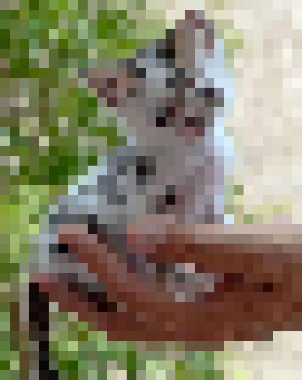
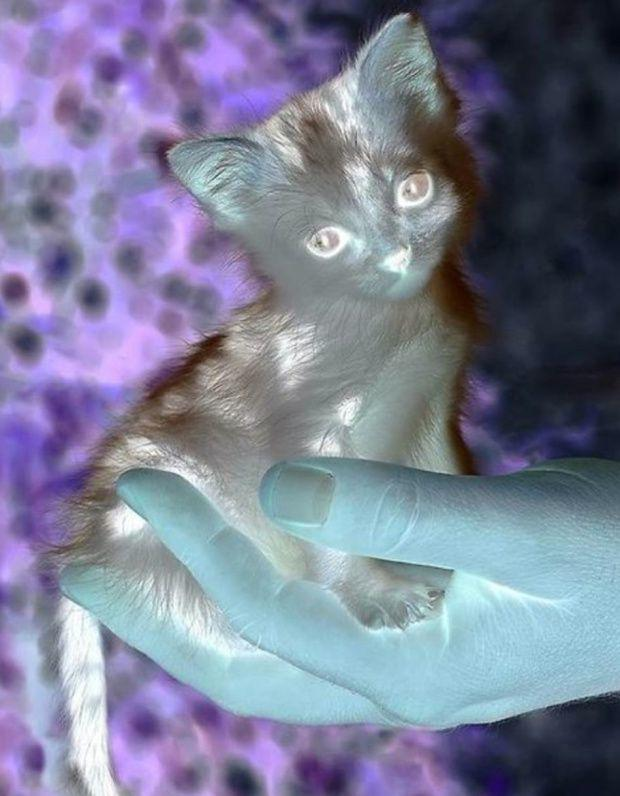
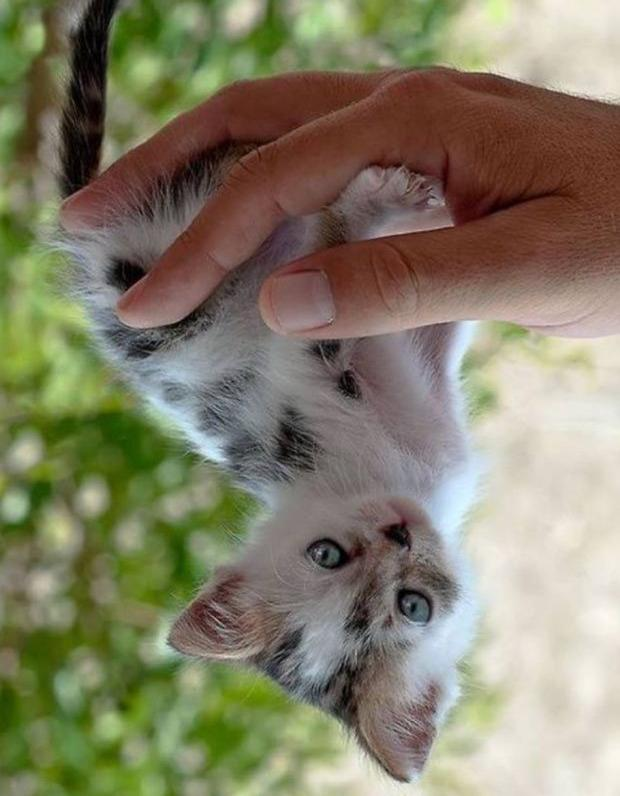
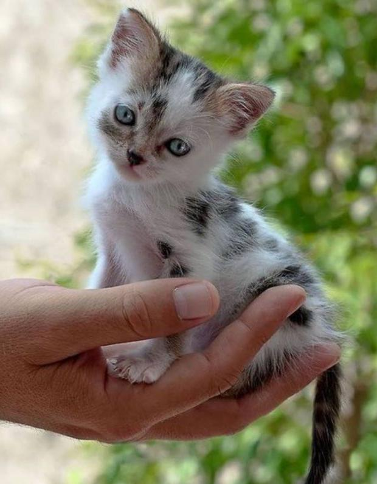

# ASCII Art Bot
## Описание
ASCII Art Bot - это Telegram-бот, который позволяет пользователям конвертировать отправленные изображения в ASCII-арт 
или пикселизировать их. Бот предоставляет удобный интерфейс для выбора опций обработки изображений.

## Функционал
1. Конвертация в ASCII-арт: Бот преобразует отправленное изображение в текстовое представление, используя символы ASCII.
2. Пикселизация изображения: Бот уменьшает разрешение изображения, создавая эффект пикселизации.
3. Инверсия цветов: Бот инвертирует цвета изображения, создавая "негатив" изображения.
4. Отражение изображения: Бот создает отраженную копию изображения по горизонтали или вертикали.

## Установка и запуск
1. Клонируйте репозиторий:

```python
git clone https://github.com/ваш-репозиторий/ascii-art-bot.git
cd ascii-art-bot
```

2. Установите зависимости:

```python
pip install -r requirements.txt
```

3. Создайте бота в Telegram:

- Напишите боту @BotFather и создайте нового бота.
- Получите токен и вставьте его в переменную TOKEN в файле art_bot.py.

4. Запустите бота:

```python
python art_bot.py
```

## Использование
1. **Запустите бота:** Отправьте команду /start или /help в Telegram для получения инструкций.
2. **Отправьте изображение:** Бот автоматически предложит вам опции для обработки изображения.
3. **Задайте набор символов:** После отправки изображения бот запросит у вас набор символов для создания ASCII-арта.
4. **Выберите опцию:** Используйте кнопки в чате для выбора между пикселизацией и ASCII-артом.

## Примеры
**ASCII-арт**
Пример ASCII-арта, который может быть сгенерирован ботом:
```text
+++***+++=++=+==--=-.....-:::....... .  
**++++*+=====**++=-=-:.-+++=::.. ...... 
#*+***==++==+**++==-==+*++++::..........
#***=++**++=-=+++++++#%*+=-=-:-::....  .
+*#*+=+***++-=+=+**==+##*=-::::......  .
**#*****+=-++*+++*#+--+*++-:..........  
++==+**+++++*#**+*++==*#+***=:........  
++-=**++++***+**+++++**#**#**-. ...... .
+++==**+++*#+====+++#%%#***+-..  ...... 
+*+--+*+=+**++*+===++++**%*=:...........
=+#**==**++===*+===+++++++=-: ..........
+=++***###+++==*+****++++===-:...:......
+=+**#####*=--=***%#*+++=++==-......... 
++++++***=::-*++=+*++++++++==:::...   ..
+++--==+=----=+++===+*%**+===:-:........
===--+==**+=-==++==+##**+==++::::.:.....
=-=-=-=+++**#*+++===++++===++-.:--::::::
+------+**++*##**++++****+++======------
+======#%###***###*###########********++
**=====+**+*##***##*#%##***########*###*
++==+****#***##*****##***++++%%%%#######
=+++%%####%%%#####*****+++*##%%%%%%#####
*#*+@@*+*###%%%%########################
=**+%@%+++**##%%%#######################
+*#*#@%==+*+++####################**+==-
+*#+*@%+=-+++==++*+***++++**++==-:-:....
*+=**@@****++++=**+=-=-=+===-:..........
+++*+#@#*#*==+=:=*+::.-+++=+=-.....    .
```

**Пикселизация**

Пример пикселизированного изображения, которое может быть сгенерировано ботом:



**Инверсия цветов**

Пример инвертированного изображения, которое может быть сгенерировано ботом:



**Отражение изображения**

Пример отраженного изображения по горизонтали:



Пример отраженного изображения по вертикали:



## Структура проекта
- **art_bot.py:** Основной файл бота, содержащий логику обработки изображений и взаимодействия с Telegram API.
- **requirements.txt:** Файл с зависимостями проекта.
- **README.md:** Этот файл, содержащий описание проекта и инструкции по установке и использованию.

## Зависимости
Проект использует следующие библиотеки:

- **telebot:** Для взаимодействия с Telegram API.
- **Pillow:** Для обработки изображений.
- **io:** Для работы с потоками данных.

## Авторы
Вереин Михаил Павлович
verein83@mail.ru

## Благодарности
Спасибо сообществу Telegram за предоставленные инструменты и API.

Спасибо разработчикам библиотек telebot и Pillow за их вклад в разработку.